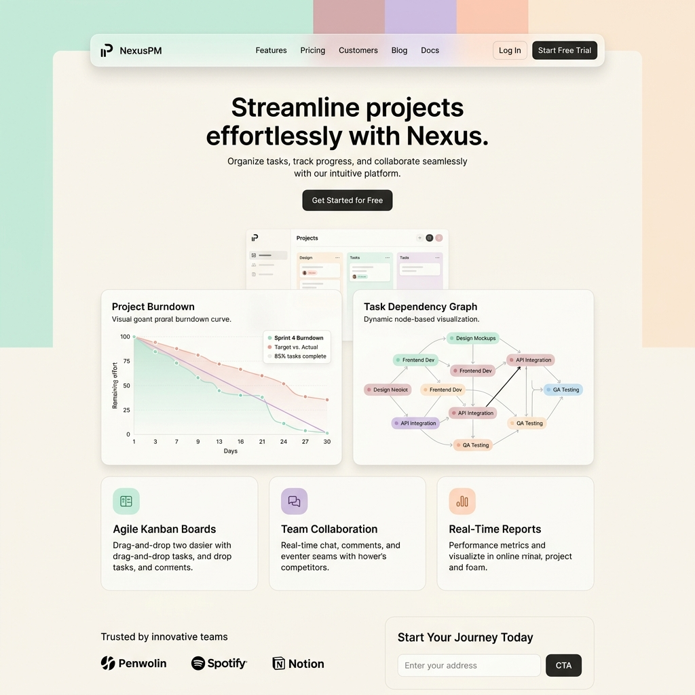
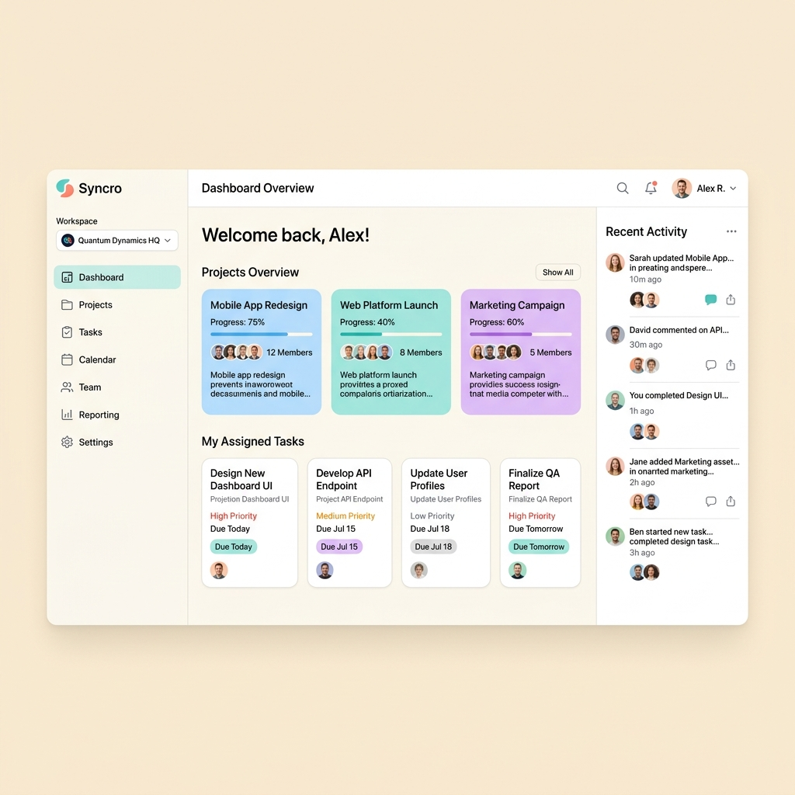
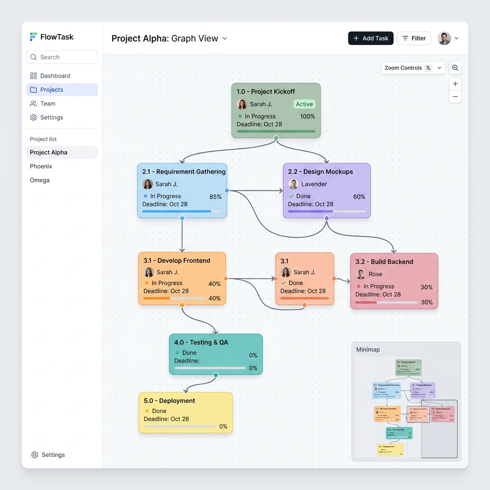
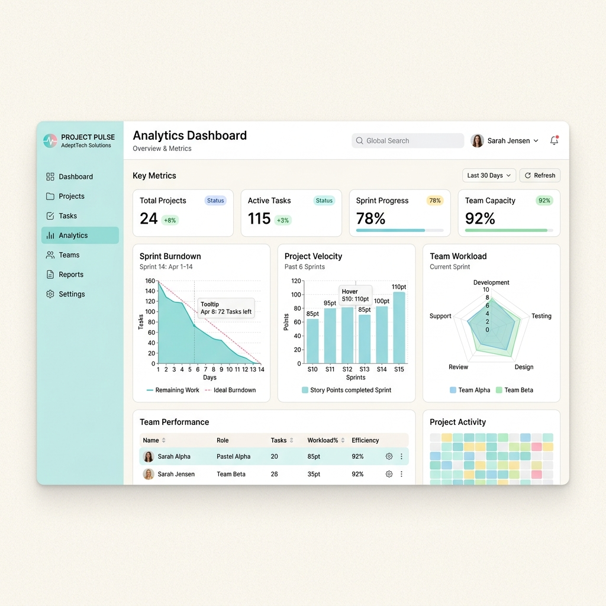
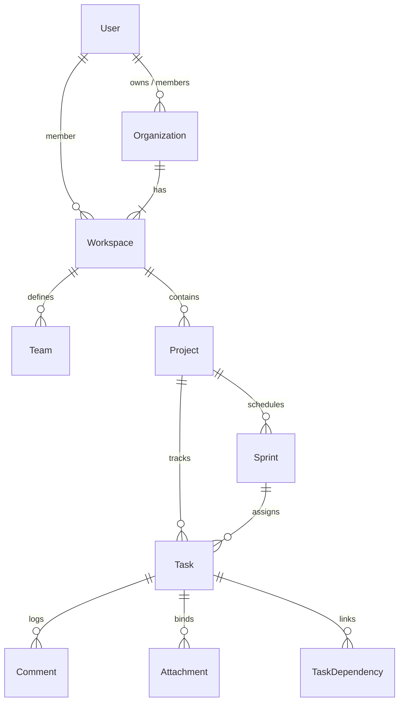
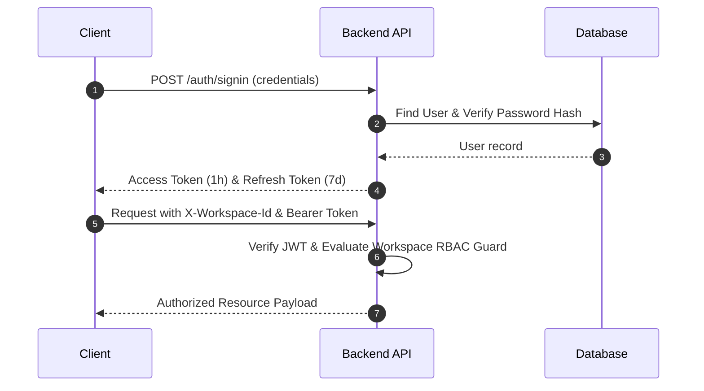
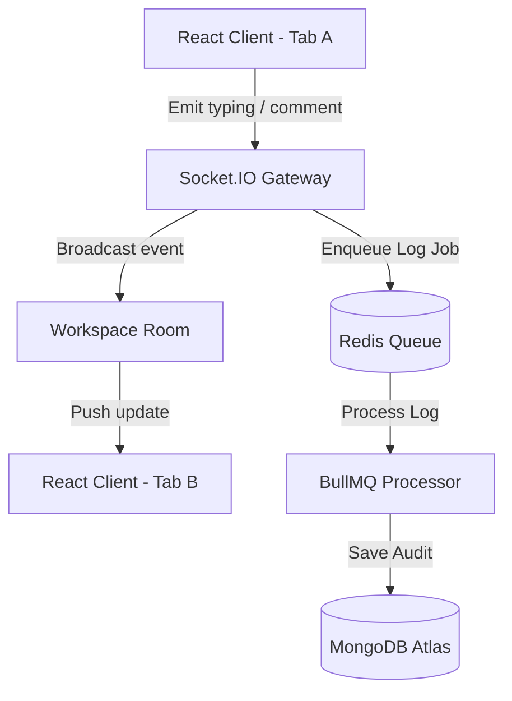

# ProjectManagementSoftware (PMS)

<div align="center">
  
  <p><em>A premium project management operating system designed for startups, agencies, enterprises, developers, and product teams.</em></p>

  [](#license)
  [](https://react.dev)
  [](https://nestjs.com)
  [](https://www.mongodb.com)
</div>

---

## 💻 Project Overview

PMS is a comprehensive workspace operating system rather than a simple task tracker. Designed to deliver high fidelity and a minimal, calm design system, PMS brings together nested teams, sprint scopes, roadmap timeline horizons, real-time collaboration engines, and interactive graph visualizations. 

Designed in a custom **Pastel-first theme** (Warm Ivory background with Lilac and Sky Mist accents), PMS matches the visual craft of applications like Linear, Arc, and Notion, while providing developers and product managers with robust telemetry and visual mapping tools.

---

## 🎨 Pastel-First Design System

PMS utilizes a strict pastel-first palette, ensuring a clean, low-noise workspace that remains calming during heavy daily use.

*   **Primary Surfaces**: Warm Ivory (`#F8F5F0`), Soft Bone (`#F5F1EA`), Cloud Cream (`#FAF7F2`)
*   **Secondary Surfaces**: Muted Lavender (`#D9D1E8`), Pastel Lilac (`#CFC5E6`), Soft Sage (`#C7D7C4`), Sky Mist (`#E5EEF8`), Powder Blue (`#D6E4F0`)
*   **Accent Surfaces**: Blush Rose (`#EFD7D7`), Dusty Peach (`#F2DDD0`), Soft Coral (`#F3D7CC`)
*   **Typography**: Charcoal (`#2D2D2D`), Graphite (`#444444`), Muted Slate (`#63666A`)

---

## 📸 Platform Showcase

### 1. Landing Experience


### 2. Workspace Dashboard


### 3. Flagship Dependency Graph (React Flow)


### 4. Sprint Telemetry Analytics


---

## 🛠️ Technology Stack

| Layer | Technologies |
| :--- | :--- |
| **Frontend** | React 19, TypeScript, Vite, Tailwind CSS v4, shadcn/ui, TanStack Query, Recharts, React Flow |
| **Backend** | NestJS 11, TypeScript, Socket.IO, Redis, BullMQ, Passport, JWT |
| **Database** | MongoDB Atlas, Mongoose ODM |
| **Storage** | Cloudinary integration |
| **Deployment** | Docker, Docker Compose, Nginx |

---

## 🏛️ System Architecture

### Monorepo Structure

```
/ (Root)
├── package.json                   # Monorepo workspaces coordinator
├── docker-compose.yml             # Development Redis and MongoDB setup
├── docker-compose.prod.yml        # Production stack build config
├── docs/
│   └── screenshots/               # High-fidelity platform mockups
├── backend/                       # NestJS Application
│   ├── src/
│   │   ├── auth/                  # JWT Strategy, RBAC guards
│   │   ├── orgs/                  # Workspaces & Organizations
│   │   ├── projects/              # Projects & Sprints management
│   │   ├── tasks/                 # Tasks, dependencies & attachments
│   │   ├── comments/              # Live comments & mentions
│   │   ├── analytics/             # Data aggregators & chart telemetry
│   │   ├── realtime/              # Socket.IO Gateway
│   │   ├── queue/                 # BullMQ background workers
│   │   └── schemas/               # Mongoose DB schemas
│   └── Dockerfile
└── frontend/                      # React SPA
    ├── public/
    │   └── branding/              # Vector favicons, logotypes
    ├── src/
    │   ├── components/            # UI components & React Flow wrappers
    │   ├── context/               # Auth and Socket providers
    │   ├── lib/                   # API client and utils
    │   ├── pages/                 # Route pages (Kanban, Roadmap, Docs)
    │   └── index.css              # Tailwind v4 theme specifications
    └── Dockerfile
```

### Database ERD Diagram



### Authentication & Authorization Flow



### Realtime Synchronization Engine



---

## 📦 Deployment Guide

### Prerequisites
*   Node.js (v24 or above)
*   npm (v11 or above)

### Local Sandbox Run (Development)

1.  **Clone the repository**:
    ```bash
    git clone https://github.com/Self-Lakshh/Project-Management-Software.git
    cd Project-Management-Software
    ```

2.  **Configure environment files**:
    Create `.env` inside `/backend`:
    ```env
    PORT=3000
    MONGO_URI=mongodb://localhost:27017/pms
    JWT_SECRET=your_jwt_signature_secret_key
    JWT_REFRESH_SECRET=your_jwt_refresh_signature_secret_key
    REDIS_HOST=localhost
    REDIS_PORT=6379
    ```

3.  **Start database containers**:
    Make sure you have MongoDB and Redis services running locally on ports `27017` and `6379` respectively.

4.  **Install dependencies and run**:
    ```bash
    # Install dependencies
    npm install
    
    # Start NestJS backend and React frontend concurrently
    npm run dev
    ```

5.  **Seed the database**:
    ```bash
    # In a separate terminal run the database seed script
    npm run seed --workspace=backend
    ```

### 🔑 Seeded Test Accounts
After running the seed script, you can log in with any of the following accounts. The password for all accounts is **`password123`**:

*   **Owner / Admin**: `lakshya@pms.io` (Name: *Lakshya Chopra*)
*   **Member**: `sarah@pms.io` (Name: *Sarah Connor*)
*   **Viewer**: `john@pms.io` (Name: *John Doe*)

### Production Build (Docker Compose)

PMS provides production-grade Dockerfiles that bundle the NestJS API server and serve the React build bundle via Nginx.

To spin up the entire cluster:
```bash
docker-compose -f docker-compose.prod.yml up --build -d
```
*   **React App**: Available on `http://localhost:80`
*   **NestJS Server**: Available on `http://localhost:3000/api`
*   **Swagger Playground**: Available on `http://localhost:3000/docs`

---

## 🚀 Future Roadmap

*   [ ] **AI Workspace Assistant**: Automatic sprint velocity forecasting and task breakdown recommendations.
*   [ ] **Interactive Document Collaboration**: Yjs-based rich-text notepad editing directly inside project templates.
*   [ ] **External API Webhooks**: Integration pipelines with GitHub, Slack, and Discord.

---

## 🤝 Contributing

Contributions to PMS are welcome. Please read our contributing guide before opening pull requests.

1.  Fork the Project
2.  Create your Feature Branch (`git checkout -b feature/amazing-feature`)
3.  Commit your Changes (`git commit -m 'add some amazing feature'`)
4.  Push to the Branch (`git push origin feature/amazing-feature`)
5.  Open a Pull Request

---

## 📄 License

Distributed under the MIT License. See `LICENSE` for more information.
